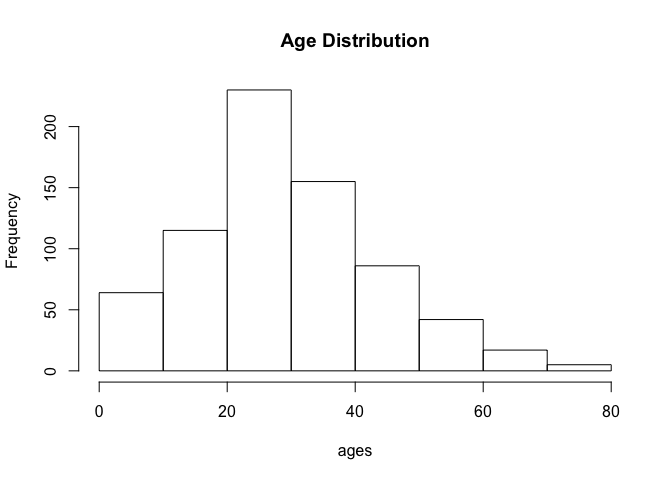
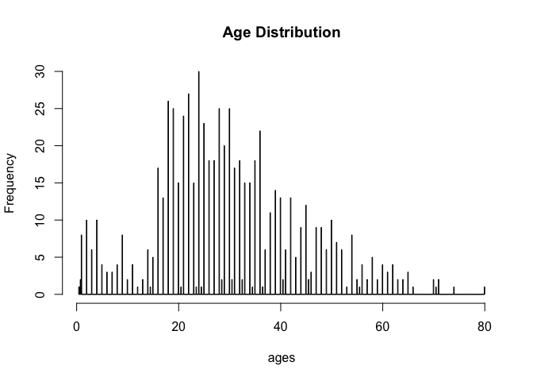
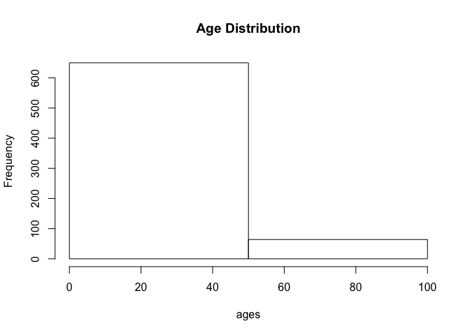
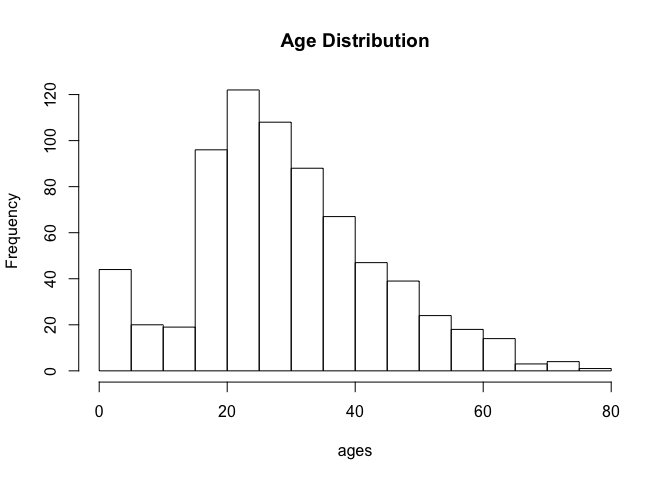

Titanic
================
Rodrigo Vallejos

##### This data was obtained from [Kaggle](https://www.kaggle.com/c/titanic/data).

## Getting Started

First load the `tidyverse` package into your search list. The search
list is a list that R uses to identify where functions are located. For
example, anything you declare can be found in the `.GlobalEnv` element
of the search list.

You can use the `require` or `library` functions, which are loaded by
default into the R search list, to load a package. The `library`
function will return an error if the package is not installed. However,
the `require` function will return a `boolean`. The `require` function
is best suited for when you are importing packages within functions.
This comes in handy for when you are building R packages.

When you load the `tidyverse`, you will see that there is a `Conflict`.
This is nothing to worry about. R is telling you that some functions
that you have imported *conflicts* with built-in functions. These would
be `filter` and `lag` from the `dplyr` package.

R will assume that you want to use the imported
    functions.

``` r
is_valid <- require(tidyverse)
```

    ## Loading required package: tidyverse

    ## ── Attaching packages ──────────────────────────────────────────────────────────────────── tidyverse 1.2.1 ──

    ## ✔ ggplot2 3.0.0     ✔ purrr   0.2.5
    ## ✔ tibble  1.4.2     ✔ dplyr   0.7.6
    ## ✔ tidyr   0.8.1     ✔ stringr 1.3.1
    ## ✔ readr   1.1.1     ✔ forcats 0.3.0

    ## ── Conflicts ─────────────────────────────────────────────────────────────────────── tidyverse_conflicts() ──
    ## ✖ dplyr::filter() masks stats::filter()
    ## ✖ dplyr::lag()    masks stats::lag()

``` r
if (!is_valid) {
  install.packages("tidyverse")
  library(tidyverse)
}
```

To import the titanic data set, you should first have installed it from
the link provided earlier. You will get a `zip` file. You unzip the file
and three files will appear. We will work with the `train.csv` file.

``` r
# Assigning the train.csv data into the titanic variable
titanic <- read_csv("./titanic/train.csv")
```

    ## Parsed with column specification:
    ## cols(
    ##   PassengerId = col_integer(),
    ##   Survived = col_integer(),
    ##   Pclass = col_integer(),
    ##   Name = col_character(),
    ##   Sex = col_character(),
    ##   Age = col_double(),
    ##   SibSp = col_integer(),
    ##   Parch = col_integer(),
    ##   Ticket = col_character(),
    ##   Fare = col_double(),
    ##   Cabin = col_character(),
    ##   Embarked = col_character()
    ## )

The above code imports the data. Since this is a standard `.csv` file,
you do not have to add any additional magic.

Let us deconstruct the string we passed through the `read_csv` function.

  - “.”: The period denotes the current working directory
  - “/titanic”: Informs R that the data is within a subdirectory called
    titanic
  - “/trains.csv”: This is the actual file that you are asking R to
    import

If the file was located in the current working directory, you could just
give the `read_csv` function the name of the file. By the way, the
`read_csv` function is part of the `tidyverse`, it is specifically being
called from the `readr` package. The build-in version for `read_csv` is
`read.csv`.

Image that you have some weird data, or you want to add a little extra
to the `read_csv` function. You can call the `args` built-in function,
which will return all the arguments that `read_csv` accepts. You can
also use the `?` operator to have R load up the documentation of a
function.

``` r
args(read_csv)
```

    ## function (file, col_names = TRUE, col_types = NULL, locale = default_locale(), 
    ##     na = c("", "NA"), quoted_na = TRUE, quote = "\"", comment = "", 
    ##     trim_ws = TRUE, skip = 0, n_max = Inf, guess_max = min(1000, 
    ##         n_max), progress = show_progress()) 
    ## NULL

## Peek inside

To get an idea of what kind of data is stored in `train.csv`, you can
use the `str` function. This function will output the *structure* fo the
data.

``` r
str(titanic)
```

    ## Classes 'tbl_df', 'tbl' and 'data.frame':    891 obs. of  12 variables:
    ##  $ PassengerId: int  1 2 3 4 5 6 7 8 9 10 ...
    ##  $ Survived   : int  0 1 1 1 0 0 0 0 1 1 ...
    ##  $ Pclass     : int  3 1 3 1 3 3 1 3 3 2 ...
    ##  $ Name       : chr  "Braund, Mr. Owen Harris" "Cumings, Mrs. John Bradley (Florence Briggs Thayer)" "Heikkinen, Miss. Laina" "Futrelle, Mrs. Jacques Heath (Lily May Peel)" ...
    ##  $ Sex        : chr  "male" "female" "female" "female" ...
    ##  $ Age        : num  22 38 26 35 35 NA 54 2 27 14 ...
    ##  $ SibSp      : int  1 1 0 1 0 0 0 3 0 1 ...
    ##  $ Parch      : int  0 0 0 0 0 0 0 1 2 0 ...
    ##  $ Ticket     : chr  "A/5 21171" "PC 17599" "STON/O2. 3101282" "113803" ...
    ##  $ Fare       : num  7.25 71.28 7.92 53.1 8.05 ...
    ##  $ Cabin      : chr  NA "C85" NA "C123" ...
    ##  $ Embarked   : chr  "S" "C" "S" "S" ...
    ##  - attr(*, "spec")=List of 2
    ##   ..$ cols   :List of 12
    ##   .. ..$ PassengerId: list()
    ##   .. .. ..- attr(*, "class")= chr  "collector_integer" "collector"
    ##   .. ..$ Survived   : list()
    ##   .. .. ..- attr(*, "class")= chr  "collector_integer" "collector"
    ##   .. ..$ Pclass     : list()
    ##   .. .. ..- attr(*, "class")= chr  "collector_integer" "collector"
    ##   .. ..$ Name       : list()
    ##   .. .. ..- attr(*, "class")= chr  "collector_character" "collector"
    ##   .. ..$ Sex        : list()
    ##   .. .. ..- attr(*, "class")= chr  "collector_character" "collector"
    ##   .. ..$ Age        : list()
    ##   .. .. ..- attr(*, "class")= chr  "collector_double" "collector"
    ##   .. ..$ SibSp      : list()
    ##   .. .. ..- attr(*, "class")= chr  "collector_integer" "collector"
    ##   .. ..$ Parch      : list()
    ##   .. .. ..- attr(*, "class")= chr  "collector_integer" "collector"
    ##   .. ..$ Ticket     : list()
    ##   .. .. ..- attr(*, "class")= chr  "collector_character" "collector"
    ##   .. ..$ Fare       : list()
    ##   .. .. ..- attr(*, "class")= chr  "collector_double" "collector"
    ##   .. ..$ Cabin      : list()
    ##   .. .. ..- attr(*, "class")= chr  "collector_character" "collector"
    ##   .. ..$ Embarked   : list()
    ##   .. .. ..- attr(*, "class")= chr  "collector_character" "collector"
    ##   ..$ default: list()
    ##   .. ..- attr(*, "class")= chr  "collector_guess" "collector"
    ##   ..- attr(*, "class")= chr "col_spec"

You may notice that the `str` function has informed about:

  - `class`: The data type that has been passed. A dataframe.
  - `obs`: The number of observations within the dataframe, 891.
  - `variables`: The number of variables present, 12.
  - A list of all the columns, or variables.
  - The data type that each column posses.
  - The first few values that the column holds.

`str` is a pretty cool function, however, the output is rather bulky.
What if you only care about the number of observations and variables?
The `dim` function will get the job done.

``` r
dim(titanic)
```

    ## [1] 891  12

Or, maybe you simply want to know about the names of the
    columns…

``` r
colnames(titanic)
```

    ##  [1] "PassengerId" "Survived"    "Pclass"      "Name"        "Sex"        
    ##  [6] "Age"         "SibSp"       "Parch"       "Ticket"      "Fare"       
    ## [11] "Cabin"       "Embarked"

You can also use the `head` or `tail` functions to look at the first or
last few values in the dataframe.

``` r
head(titanic)
```

    ## # A tibble: 6 x 12
    ##   PassengerId Survived Pclass Name  Sex     Age SibSp Parch Ticket  Fare
    ##         <int>    <int>  <int> <chr> <chr> <dbl> <int> <int> <chr>  <dbl>
    ## 1           1        0      3 Brau… male     22     1     0 A/5 2…  7.25
    ## 2           2        1      1 Cumi… fema…    38     1     0 PC 17… 71.3 
    ## 3           3        1      3 Heik… fema…    26     0     0 STON/…  7.92
    ## 4           4        1      1 Futr… fema…    35     1     0 113803 53.1 
    ## 5           5        0      3 Alle… male     35     0     0 373450  8.05
    ## 6           6        0      3 Mora… male     NA     0     0 330877  8.46
    ## # ... with 2 more variables: Cabin <chr>, Embarked <chr>

## Working with data

We can start to see that these function names are rather intuitive. If
we want the column names, all we need to do is call the the `colnames`
function, for example.

Lets not ignore that `$` sign. This is an operator that will allow you
to directly access particular columns of your dataframe.

Lets grab the `Age` column.

``` r
ages <- titanic$Age
```

Image you want to get the average of the ages. Well you can simply call
the `mean` function\!

``` r
mean(ages)
```

    ## [1] NA

Uh oh\! The mean function returned `NA`… Thats not very useful… Lets
inspect ages for a second.

``` r
head(ages)
```

    ## [1] 22 38 26 35 35 NA

Ah\! `ages` also has `NA` values inside of it. `NA` is R’s version of
`None` or `null`, essentially a way of representing a “nothing” value.

Hmmmmm, how can we get over this hurdle? Let us check if the `mean`
function have anything that can help us with this problem.

``` r
?mean
```

Reading through the documentation of `mean`, there is mention of this
`na.rm`. That sounds useful\! It seems that if we pass in this argument
as `TRUE`, `mean` will be able to get rid of those pesky `NA`’s.

``` r
mean(ages, na.rm=TRUE)
```

    ## [1] 29.69912

Alas, we get our mean age (29.69912). The reason why `mean` was not
doing this before is because `na.rm` had a **default** value or `FALSE`.
This means that we had to manually tell `mean` to activate its `na.rm`
functionality.

**IMPORTANT**: Every time you run into empty values in your data set,
always ask your why that cell may be empty. Incorrect data entry? Simply
a lack of data? Nefarious deeds? etc.

As we work through the above problem, we used the `head` function again
to show us the first few elements of `ages`.

It is important to note that `ages` is not a dataframe. `ages` is
actually a `vector`. In R, most things are of `vector` class. For
example, `2` is not considered to be the number `2`, but a vector of
length 1, with an numeric element of value 2.

A `vector` is an *homogenous* array of values, therefore, every value in
a `vector` must be of the same type. There are also `lists`, which are
*heterogenous* arrays of values.

Lets look at what an `Age` list looks list.

``` r
age_list <- as.list(ages)
class(ages)
```

    ## [1] "numeric"

``` r
class(age_list)
```

    ## [1] "list"

``` r
tail(age_list)
```

    ## [[1]]
    ## [1] 39
    ## 
    ## [[2]]
    ## [1] 27
    ## 
    ## [[3]]
    ## [1] 19
    ## 
    ## [[4]]
    ## [1] NA
    ## 
    ## [[5]]
    ## [1] 26
    ## 
    ## [[6]]
    ## [1] 32

Lets deconstruct what just happened:

1.  We used the `as.list` function to transform the `ages` vector into a
    list and assign it to the `ages_list` variable.
2.  We call the `class` fuction on `ages` and `age_list`.

<!-- end list -->

  - `class(ages)`: The output is `numeric`, this means it is a vector of
    numeric values.
  - `calss(age_list)`: The output is `list`. Note that it did not
    specify the data type.

<!-- end list -->

3.  This time we called the `tail` function, and see that the output of
    the list is differnt from that of a vector. We get these weird
    headers `[[some_number]]`. These ehaders are actually quite useful,
    since they tell you how to access that value.

<!-- end list -->

``` r
ages[1]
```

    ## [1] 22

``` r
age_list[[1]]
```

    ## [1] 22

For a vector, you just have to your `[]`. For a list you have to use
`[[]]`. The number passed through the square brackets is just the
relative position of the value you are looking for within that vector or
list.

## A bit of basic plotting

Lets start exploring our dataframe\!

A histogram is a good way to start with data such as `Age`. This will
inform us about the relative frequencies (distribution) of our `Age`.

``` r
hist(ages, main="Age Distribution")
```

<!-- -->

How interesting\! The highest peak is somewhere in between 20 to 30. We
could already have assume this, given that we calculated the mean
earlier, assuming that `Age` is unimodal. However, it is important that
you always try different number of bars (or *bins*) in your histogram.
The first visuzalization may not always be the best representation of
the distribution.

For example, below is a histogram with `891` bins… That is one bin per
observation\! This is definitively not that useful.

``` r
hist(ages, breaks=891, main="Age Distribution")
```

<!-- -->

Now, `2` bins… This isn’t better\!

``` r
hist(ages, breaks=2, main="Age Distribution")
```

<!-- -->

``` r
hist(ages, breaks=12, main="Age Distribution")
```

<!-- -->

This look promising\! But it has this weird peak at the start… Hmmmm,
there is the general trend that if first histogram had… but that peak
was not as prevalent. You should think about what that peak represents.

**IMPORTANT**: If you want fancier plots, check out `ggplot2` and
`ggvis`. `ggplot2` is in the `tidyverse`, `ggvis` is not.

## Basic Manipulation

Lets start manipulating our initial dataframe a bit. I think that
looking at `Surivived`, `Age`, `Pclass` (passenger class) and `Sex`
would be rather interesting. There are multiple ways of isolating these
columns; since we are lazy, we should follow the `dplyr` and `piping`
way of doing things.

`dplyr` is another package that can be found as part of the `tidyverse`.

`piping` is done by the `%>%` operator. Below is an example of `piping`.
This is not part of *base R*, but an operator that has been imported,
once more, from the `tidyverse` in the `magrittr` package. Rather than
having to call some input within the parenthesis of the function name,
you can place your input before your function name followed by the `%>%`
and the function name, without the parethesis.

``` r
# no piping
mean(c(2,3))
```

    ## [1] 2.5

``` r
# piped
c(2, 3) %>% mean
```

    ## [1] 2.5

Ok, lets get to our data\!

``` r
new_df <- titanic %>%
  select(Pclass, Survived, Age, Sex)
tail(new_df)
```

    ## # A tibble: 6 x 4
    ##   Pclass Survived   Age Sex   
    ##    <int>    <int> <dbl> <chr> 
    ## 1      3        0    39 female
    ## 2      2        0    27 male  
    ## 3      1        1    19 female
    ## 4      3        0    NA female
    ## 5      1        1    26 male  
    ## 6      3        0    32 male

`Survived` has these `0`’s and `1`’s. Wonder what they mean… If your
data is well documented, the meaning behind such these shorthands should
be defined. `0` means that this person did not survive, while `1` means
that the person did survive.

It looks like the `Sex` column only registers two values. You can call
these categorical values, or `factors`. Specifically, the `female` and
`male` **`levels`** are *nominal categorical variables*. I encourage you
to read more about different types of categorical variables.

``` r
class(new_df$Sex)
```

    ## [1] "character"

``` r
factor_sex <- factor(new_df$Sex)
class(factor_sex)
```

    ## [1] "factor"

``` r
levels(factor_sex)
```

    ## [1] "female" "male"

A `factor` is its own data type in R. We see that initially `new_df` is
a “character” (a string), but after being passed through `factor` is
changes to a `factor` type. `factor` have levels, which are the
categories that exists. Another way to think about it is in a vector of
“male” and “female”, the **unique** values are “female” and “male”.
The unique values would be the categories, in this example.

I really want those levels to be capitalized… How could we tell R to
*change* them to there capitalized form? In other words, how can *we*
tell R what the levels should be?

``` r
levels(factor_sex) <- c("Female", "Male")
levels(factor_sex)
```

    ## [1] "Female" "Male"

We can assign a vector of strings, with our desired levels, to the
function call of `levels(factor_sex)`. This will change the levels to
our desired ones. We must be cautious, since if we had assigned
`c("Male", "Female")`, R would have switched all `"female"` with
`"Male"`. R will store your levels in alphabetical order by default.

A more flashy way of doing it, but needlessly complicated is as follows.

``` r
factor_sex <- factor(vapply(factor_sex, str_to_title, character(1)))
levels(factor_sex)
```

    ## [1] "Female" "Male"

Whoa, that a bit too much all at once\! Let us examine the above code.

  - What functions are being called?
      - `factor`: We encountered this one before. It will change a
        vector of characters into a vector of factors, which have
        levels.
      - `vapply`: This function *applies* the `str_to_title_` function
        to every element in the `factor_sex` vector, and will return a
        vector of characters.
          - `character(1)` is being passed through because it tells
            `vapply` what the output should be. If it is not a vector of
            characters, then `vapply` will raise an error.
      - `str_to_title`: Another function that lies within the
        `tidyverse`, in the `stringr` package. Find out what is does by
        running `?str_to_title` on your R console.

**IMPORTANT**: There is a family of `apply` functions. `vapply` is
actually an overcomplication of this operation. Look up other `apply`
functions, such as `sapply` and `lapply`. The ones I mentioned all do
the same operation, it is their output that differs.

  - `vapply` return a vector.
  - `sapply` tries to return a vector, otherwise returns list.
  - `lapply` always returns a list.

**QUESTION**: If the category was longer than one word, what will happen
we your the `str_to_title` function?

If what happened above made no sense to you, that is ok. I do encourage
you to look up the `apply` functions since they will become one of the
most powerful tools you will have in your arsenal. One question you
should think about is why are there so many different types? Why would
you use `vapply` over `sapply`?

However this has not really solved my problem… If we open up the
`new_df` dataframe, `Sex` column has not been modified at all\! How
could this happen… we literally just did it. Well we actually only
altered the `factor_sex` vector, not the original dataframe.

``` r
new_df$Sex <- factor(new_df$Sex)
new_df$Sex <- sapply(new_df$Sex, str_to_title)
head(new_df)
```

    ## # A tibble: 6 x 4
    ##   Pclass Survived   Age Sex   
    ##    <int>    <int> <dbl> <chr> 
    ## 1      3        0    22 Male  
    ## 2      1        1    38 Female
    ## 3      3        1    26 Female
    ## 4      1        1    35 Female
    ## 5      3        0    35 Male  
    ## 6      3        0    NA Male

Well that was much simpler than what we did previously.

1.  We turned the `factor` function that turned the `Sex` columne from
    `strings` to `factors`.
2.  We then turned each factor in `Sex` to its properly capitalized
    form. We even used `sapply` and not its scary cousing `vapply`\!
3.  We then display our dataframe to show the change.

If you notice, we didn’t even use the `levels` function. However, we had
used that function previously so that we would learn that you can assign
the `levels`.

If you really don’t care for this `factor` business, you can also
continue using `dplyr` to make these changes.

``` r
new_df <- titanic %>%
  select(Pclass, Survived, Age, Sex) %>%
  mutate(Sex=str_to_title(Sex))
head(new_df)
```

    ## # A tibble: 6 x 4
    ##   Pclass Survived   Age Sex   
    ##    <int>    <int> <dbl> <chr> 
    ## 1      3        0    22 Male  
    ## 2      1        1    38 Female
    ## 3      3        1    26 Female
    ## 4      1        1    35 Female
    ## 5      3        0    35 Male  
    ## 6      3        0    NA Male

What sorcery is this\!

1.  We are redefining our `new_df`
2.  We **pipe** titanic to `select`, and get the same columns as before
3.  We **pipe** `select`’s output to `mutate`.
4.  Call `head`

`mutate` is define in the `dplyr` package. This function you assign a
new column or a pre-existing column in your dataframe a sequence of
values. In this case, we simply defined the `Sex` column to the
capitalized version of `Sex`.
