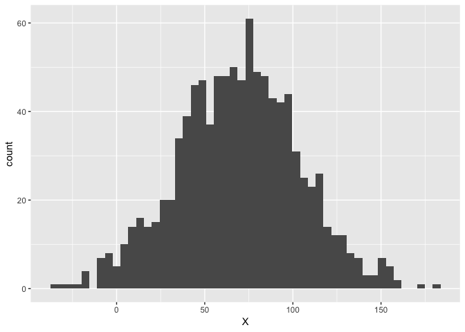
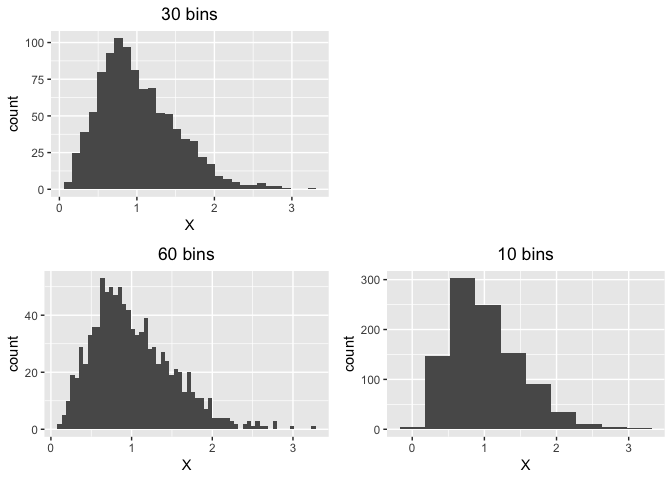
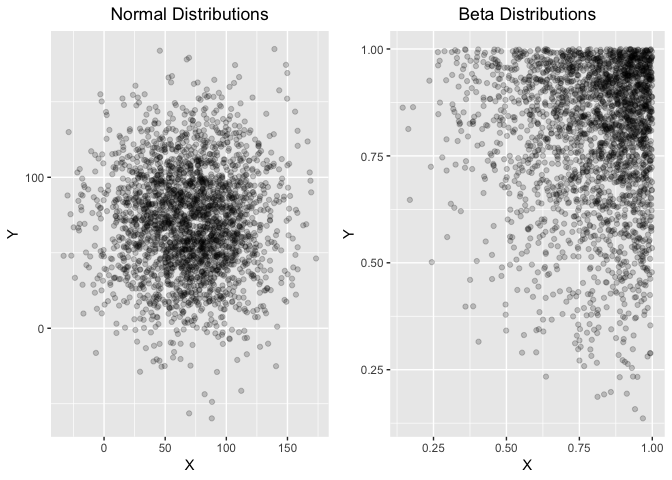
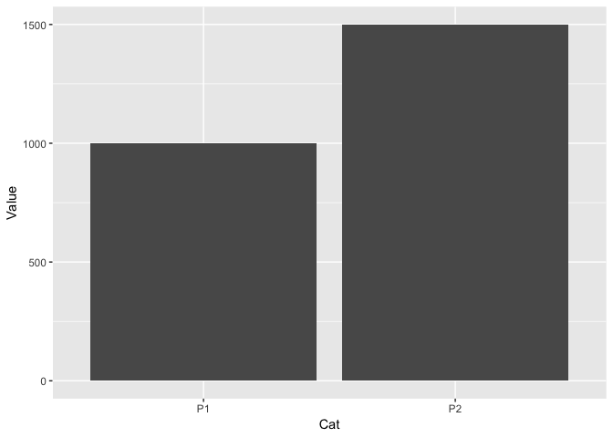
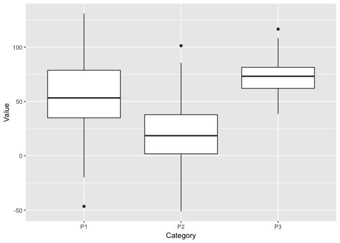
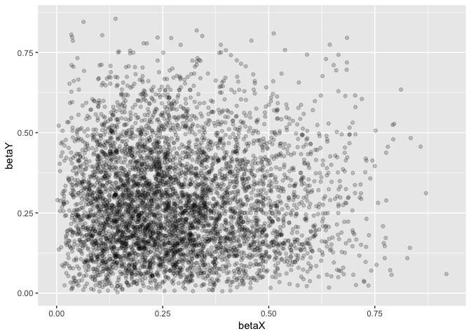
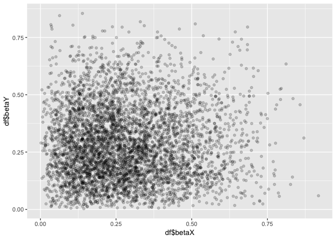
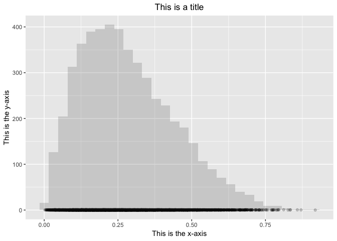
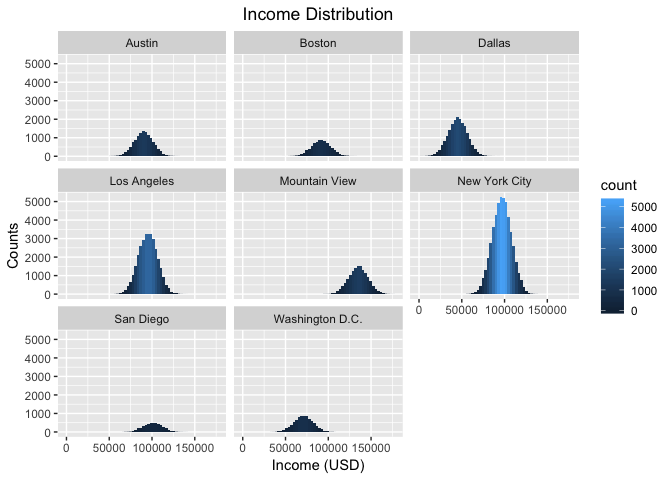
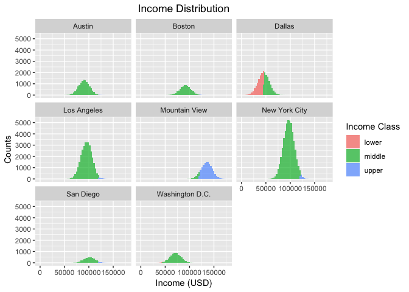

R Tutorial
================
Rodrigo Vallejos

# Table of Contents

1.  [Setting up](#setting-up)
2.  [Importing our data](#importing-our-data)
3.  [First glance](#first-glance)
4.  [Subset](#subsetting)
      - [Position](#subset-by-position)
      - [Row and column](#subset-by-row-and-column)
      - [Arrays](#subset-with-arrays)
      - [Column name 1](#subset-by-column-name-1)
      - [Column name 2](#subset-by-column-name-2)
      - [Subsetting with conditions](#subsetting-with-conditions)
5.  [`dplyr`](#dplyr)
      - [Piping](#piping)
      - [`select`](#select)
      - [`filter`](#filter)
      - [`mutate`](#mutate)
      - [`group_by` & `summarize`](#group_by-&-summarize)
      - [`arrange`](#arrange)
      - [`rename`](#rename)
6.  [Visualization](#visualization)
      - [Types of plots](#types-of-plots)
          - [Histogram](#histograms)
          - [Scatter plot](#scatter-plot)
          - [Line plot](#line-plot)
          - [Bar chart](#bar-chart)
          - [Box plot](#box-plot)
      - [`ggplot2`](#ggplot2)
          - [Grammar](#grammar)
          - [Visualizing our data](#visualizing-our-data)

# Setting up

``` r
if (!require(tidyverse)) {
  install.packages("tidyverse")
  library(tidyverse)
}
```

    ## Loading required package: tidyverse

    ## ── Attaching packages ───────────────────────────────────────────────────────────────────────────────────── tidyverse 1.2.1 ──

    ## ✔ ggplot2 3.0.0     ✔ purrr   0.2.5
    ## ✔ tibble  1.4.2     ✔ dplyr   0.7.6
    ## ✔ tidyr   0.8.1     ✔ stringr 1.3.1
    ## ✔ readr   1.1.1     ✔ forcats 0.3.0

    ## ── Conflicts ──────────────────────────────────────────────────────────────────────────────────────── tidyverse_conflicts() ──
    ## ✖ dplyr::filter() masks stats::filter()
    ## ✖ dplyr::lag()    masks stats::lag()

The `tidyverse` is a collection of packages, such as `ggplot2` and
`dplyr`, that have multiple tools not offered in base R. You can find
more information about the `tidyerse` by clicking on this
[link](https://www.tidyverse.org/).

When we import the `tidyverse`, you will see a **Conflicts** warning.
This is of no concern. It is just informing us that certain functions
that are defined in the `dplyr` package have the same name as functions
in base R. The imported functions will be used.

**SIDE NOTE**: We can import packages through the `library` or the
`require` functions. If a package does not exist, `library` will raise
an error and `require` will produce a `logical`, or `boolean`. This
logical value represents if the import was successful, `TRUE`, or
failed, `FALSE`.

# Importing our data

We are using a toy, fictional, dataset obtained from
[Kaggle](https://www.kaggle.com/carlolepelaars/toy-dataset).
Fortunately, this data is stored as a `.csv`, comma-separated values.
This is a standard format that stores tabular data as text. Each cell,
value, is separated by a comma.

**SIDE NOTE**: There are other ways to store data as text. The use of a
comma could be substituted by `;`, for instance. I encourage you to find
more information on *flat files*.

``` r
path <- file.path("toy_dataset.csv")
```

Above is the *path* to our data. Be sure to have downloaded and unzipped
the data from Kaggle in the same directory, folder, as this notebook. We
use the `file.path` function to design a *path* that is independent of
the operating system which we may be using. We assign this constructed
path to the `path` variable.

For this case, `file.path` is not that useful, given that the `.csv`
file should be resting within the working directory of this R notebook.

``` r
dat <- read_csv(path)

# This would also work, if in the same directory as notebook
dat <- read_csv("toy_dataset.csv")
```

After defining our path, we can call the `read_csv`, a function from the
`readr` package, to parse through our file and store our data as a
`tibble`. A `tibble` is a modern version of a dataframe.The main
differences between a tibble and a dataframe are printing, subsetting,
and recycling. You can find out more information about what that means
by clicking on this
[link](https://cran.r-project.org/web/packages/tibble/vignettes/tibble.html).

It is important to note that base R also has a function to parse through
`.csv` files…

``` r
example1 <- read.csv(path, stringsAsFactors = FALSE)
```

The `read.csv` is a wrapper function around `read.table`. With
`read.csv` we would have to specify that the `strings`, or `characters`,
in our `.csv` file, are **not** of `factor` type. We will cover `factor`
types briefly, later on. There are other reasons to use `read_csv`, such
as speed, but it does not matter for the pursposes of this introduction.

**SIDE NOTE**: If you are curious to find more information about a
function in R, you can use the `?` operator. In the R console, type
`?read.csv`. You will be directed to the `read.csv` documentation within
RStudio.

# First glance

The first thing you should do when getting a new data set is to start
familiarizing yourself with its content. We can use the `head` or `tail`
functions to look into the first or last few rows of our data.

``` r
head(dat)
```

    ## # A tibble: 6 x 6
    ##   Number City   Sex      Age Income Illness
    ##    <int> <chr>  <chr>  <int>  <dbl> <chr>  
    ## 1      1 Dallas Male      41  40367 No     
    ## 2      2 Dallas Male      54  45084 No     
    ## 3      3 Dallas Male      42  52483 No     
    ## 4      4 Dallas Male      40  40941 No     
    ## 5      5 Dallas Male      46  50289 No     
    ## 6      6 Dallas Female    36  50786 No

Looking at the first or last few rows is good and all, but it’s still
not enough to get familiar with this data. Another nifty tool is `str`,
which gives you the *structure* of your data.

  - Class of the variable being passed: `tbl_df`, `tbl` and `data.frame`
  - Number of observations: `150000 obs`
  - Number of variables: `6 variables`
  - Column names
  - Data type of each column
  - The first few values of that column

`give.attr = FALSE` tells `str` not to print the attributes. You can
remove that argument from the function call, and the output will include
the attributes. Removing `give.attr = FALSE` displays the attributes
since `give.attr` has a default value of
    `TRUE`.

``` r
str(dat, give.attr = FALSE)
```

    ## Classes 'tbl_df', 'tbl' and 'data.frame':    150000 obs. of  6 variables:
    ##  $ Number : int  1 2 3 4 5 6 7 8 9 10 ...
    ##  $ City   : chr  "Dallas" "Dallas" "Dallas" "Dallas" ...
    ##  $ Sex    : chr  "Male" "Male" "Male" "Male" ...
    ##  $ Age    : int  41 54 42 40 46 36 32 39 51 30 ...
    ##  $ Income : num  40367 45084 52483 40941 50289 ...
    ##  $ Illness: chr  "No" "No" "No" "No" ...

You could also just want the number of observations or variables. You
can call the `dim` function that gives you the *dimensions* of an input.
The first element is the number of rows, observations, and then the
number of columns, variables.

``` r
dim(dat)
```

    ## [1] 150000      6

You can also look at the names of the columns with the `colnames`
function.

``` r
colnames(dat)
```

    ## [1] "Number"  "City"    "Sex"     "Age"     "Income"  "Illness"

Finally, there is also the `summary` function. This allows you to have a
small report of basic descriptive statistics of the dataframe’s
variables.

``` r
summary(dat)
```

    ##      Number           City               Sex                 Age       
    ##  Min.   :     1   Length:150000      Length:150000      Min.   :25.00  
    ##  1st Qu.: 37501   Class :character   Class :character   1st Qu.:35.00  
    ##  Median : 75000   Mode  :character   Mode  :character   Median :45.00  
    ##  Mean   : 75000                                         Mean   :44.95  
    ##  3rd Qu.:112500                                         3rd Qu.:55.00  
    ##  Max.   :150000                                         Max.   :65.00  
    ##      Income         Illness         
    ##  Min.   :  -654   Length:150000     
    ##  1st Qu.: 80868   Class :character  
    ##  Median : 93655   Mode  :character  
    ##  Mean   : 91253                     
    ##  3rd Qu.:104519                     
    ##  Max.   :177157

We found our first oddity\! If we gear our attention to the minimum
value of `Income`, we notice that it is a negative number. We will
remove negative values from our data.

``` r
dat <- dat[dat$Income > 0, ]
summary(dat)
```

    ##      Number           City               Sex                 Age       
    ##  Min.   :     1   Length:149999      Length:149999      Min.   :25.00  
    ##  1st Qu.: 37502   Class :character   Class :character   1st Qu.:35.00  
    ##  Median : 75001   Mode  :character   Mode  :character   Median :45.00  
    ##  Mean   : 75001                                         Mean   :44.95  
    ##  3rd Qu.:112500                                         3rd Qu.:55.00  
    ##  Max.   :150000                                         Max.   :65.00  
    ##      Income         Illness         
    ##  Min.   :   584   Length:149999     
    ##  1st Qu.: 80868   Class :character  
    ##  Median : 93655   Mode  :character  
    ##  Mean   : 91253                     
    ##  3rd Qu.:104519                     
    ##  Max.   :177157

Notice that `Illness`, `Sex`, and `City` are not giving us much useful
information. It tells us the length of the column, the class and the
mode. I will leave `City` as is for now, given that its current format
will allow me to show you some other tools later on.

``` r
dat[, "Illness"] <- factor(dat$Illness)
dat[, "Sex"] <- factor(dat$Sex)

summary(dat)
```

    ##      Number           City               Sex             Age       
    ##  Min.   :     1   Length:149999      Female:66199   Min.   :25.00  
    ##  1st Qu.: 37502   Class :character   Male  :83800   1st Qu.:35.00  
    ##  Median : 75001   Mode  :character                  Median :45.00  
    ##  Mean   : 75001                                     Mean   :44.95  
    ##  3rd Qu.:112500                                     3rd Qu.:55.00  
    ##  Max.   :150000                                     Max.   :65.00  
    ##      Income       Illness     
    ##  Min.   :   584   No :137861  
    ##  1st Qu.: 80868   Yes: 12138  
    ##  Median : 93655               
    ##  Mean   : 91253               
    ##  3rd Qu.:104519               
    ##  Max.   :177157

We are now getting some more useful information. We can now tell how
many `Female` and `Male` individuals are represented in this data. We
can also see how many individuals are have an `Illness`.

What exactly happened though? Before our the `Sex` and `Illness` columns
where of `character` type, or just plain text. However, we know that
`Female` and `Male` and `No` and `Yes` can be treated as *categorical*
data. More specifically, `Sex` and `Illness` are *nominal categorical
variables*. By using the `factor` function, R is now aware that there
are two categories in `Sex` and in `Illness`, therefore, it will be able
to perform certain statistics keeping these categories in mind.

**SIDE NOTE**: There are also *ordinal categorial variables*. As their
name implies, these are categorical variables with some sort of *order*.
For example, “cold” and “hot” are categorical values. At the same time,
we know that “cold” is less than “hot”. However, saying that “Yes” is
greater than “No” in `Illness` does not make much sense.

The case of our `Income` ourlier and categorical variables, we somehow
managed to change those values, fairly easily. The former case, we
managed to tell R that we only want the *rows* that have `Income`’s
greater than 0. In the latter case, we selected a column in the
dataframe and assigned it new values based on what was already there.

The way you access those segments of your data is through subsetting,
which is the topic of our next section.

# Subsetting

So far we have managed to import our packages, load our data, and see
its structure. But how can we access the data? There are actually
multiple ways to subset your data, we will go through a couple of
examples.

**DEFINITION**: Subsetting is the extraction of parts from a whole.

**KEY POINTS**:

  - Every element is *indexed*. Their index can be either numerical or
    by name.
  - `Number` is the first column, and thus, it is of column position
    `1`. `Age` is the fourth column, and therefore, it is in column
    position `4`.
  - You can get a specific row nad column by using squarebrackets, `[ ,
    ]`.
      - Example: `dataframe_name[<ROW_POSITION>, <COLUMN_POSITION>]`
  - You can get a specific column using `[[` or `$` operators.
  - `[[` and `$` will return the column as a vector, not a dataframe

## Subset by position:

  - Leaving either the row or column segment empty means that you are
    requesting all elements.
  - Column name must be in quotes.

<!-- end list -->

``` r
# Subsetting by column position and name
head(dat[, 4] == dat[, "Age"])
```

    ##       Age
    ## [1,] TRUE
    ## [2,] TRUE
    ## [3,] TRUE
    ## [4,] TRUE
    ## [5,] TRUE
    ## [6,] TRUE

  - If you do not specify any column position, you will simply get the
    entire row of the dataframe

<!-- end list -->

``` r
dat[2, ]
```

    ## # A tibble: 1 x 6
    ##   Number City   Sex     Age Income Illness
    ##    <int> <chr>  <fct> <int>  <dbl> <fct>  
    ## 1      2 Dallas Male     54  45084 No

## Subset using row and column:

  - To get a specific value from a dataframe, pass in a row position and
    a column position
  - Column name must be in quotes

<!-- end list -->

``` r
dat[2, 4] == dat[2, "Age"]
```

    ##       Age
    ## [1,] TRUE

## Subset with arrays:

  - The `[]` operator can take a number, a name, and an *array* of
    values.
  - If you want to get `Age` and `Income`, you will have to pass an
    array of their positions or names.
  - Column names must be in quotes

<!-- end list -->

``` r
head(dat[, c("Age", "Income")]) == head(dat[, c(4, 5)])
```

    ##       Age Income
    ## [1,] TRUE   TRUE
    ## [2,] TRUE   TRUE
    ## [3,] TRUE   TRUE
    ## [4,] TRUE   TRUE
    ## [5,] TRUE   TRUE
    ## [6,] TRUE   TRUE

  - If you want rows 50 to 100, and you are too lazy to right an array
    containing all those numbers, you can use the `:` operator. `:`
    accepts a start and end value, and creates a sequence.

<!-- end list -->

``` r
1:3
```

    ## [1] 1 2 3

``` r
dat[50:100, ]
```

    ## # A tibble: 51 x 6
    ##    Number City   Sex      Age Income Illness
    ##     <int> <chr>  <fct>  <int>  <dbl> <fct>  
    ##  1     50 Dallas Female    56  52218 No     
    ##  2     51 Dallas Female    55  47702 No     
    ##  3     52 Dallas Male      42  62512 No     
    ##  4     53 Dallas Female    58  48655 No     
    ##  5     54 Dallas Male      57  55133 No     
    ##  6     55 Dallas Male      32  39309 No     
    ##  7     56 Dallas Female    55  41036 No     
    ##  8     57 Dallas Male      62  60594 No     
    ##  9     58 Dallas Female    43  46373 No     
    ## 10     59 Dallas Male      35  53303 No     
    ## # ... with 41 more rows

## Subset by column name (1):

  - If you already know you want the entire column, you can just use the
    `[[` operator.
  - The column name must be in quotes.

<!-- end list -->

``` r
head(dat[["Age"]])
```

    ## [1] 41 54 42 40 46 36

## Subset by column name (2):

  - You can also use the `$` subset operator to get a column from your
    dataframe
  - Write the column name after `$`, with **no** quotes.

<!-- end list -->

``` r
head(dat$Age)
```

    ## [1] 41 54 42 40 46 36

## Subsetting with conditions:

Can we get the rows of individuals that live in `"Dallas"` and are older
than `50`?

1.  Test *which* elements in `dat$City` column are equal to `"Dallas"`.
2.  Test *which* elements in `dat$Age` column are greater than `50`.
3.  In between those two test, add the `&`, AND, operator. This operator
    will only return `TRUE` if its *operands* are `TRUE`.
4.  **OPTIONAL**: Store this new `logical` vector into a new variable.
5.  Pass the vector through the `<ROW_INDEX>` segment of `[]` on your
    dataframe.

<!-- end list -->

``` r
dallas_and_g50 <- dat$City == "Dallas" & dat$Age > 50
dat[dallas_and_g50, ]
```

    ## # A tibble: 7,183 x 6
    ##    Number City   Sex      Age Income Illness
    ##     <int> <chr>  <fct>  <int>  <dbl> <fct>  
    ##  1      2 Dallas Male      54  45084 No     
    ##  2      9 Dallas Male      51  68667 No     
    ##  3     15 Dallas Female    61  38429 No     
    ##  4     21 Dallas Male      57  17378 No     
    ##  5     25 Dallas Male      58  55190 No     
    ##  6     26 Dallas Male      64  26169 No     
    ##  7     27 Dallas Male      58  57322 No     
    ##  8     33 Dallas Female    55  42630 No     
    ##  9     35 Dallas Female    63  41946 No     
    ## 10     37 Dallas Male      64  47872 No     
    ## # ... with 7,173 more rows

If you did not want the actual data, but just the indices where these
value are stored, you can use the `which` function. This will take in a
`logical` vector, and return a vector with the index value at any point
where the original vector has a `TRUE`.

``` r
tail(which(dallas_and_g50))
```

    ## [1] 19691 19695 19698 19700 19702 19706

You can perform another test, were you are looking for people who live
in `Dallas`, or are older than `50`. The same procedure as above
applied. The difference is the logical operator used. This time we want
the `|`, OR, operator. It will only return `FALSE` if its operands are
`FALSE`.

``` r
head(dat$City == "Dallas" | dat$Age > 50)
```

    ## [1] TRUE TRUE TRUE TRUE TRUE TRUE

# `dplyr`

`dplyr` will be one of the most powerful packages in your toolbox. This
package helps with *data wrangling*, or munging, which is the act of
manipulating/transforming your data into a form that is more conducise
for downstsream processing.

## Piping

Before we get into `dplyr` functions, we must first learn about
**piping**.

Piping allows you to pass the output of one function as the input of
another. The pipe operator in R is `%>%`, and it is found in the
`magrittr` package of the `tidyverse`.

Below we are getting the mean of individuals that live in Dallas and are
older than 50. We then get the `Income` column, convert it to the
thousands, and then calculate the overall mean income. We will cover
these functions in a second. What is important to take out of this
example is how ugly this code
is\!

``` r
summarize(mutate(select(filter(dat, City == "Dallas" & Age > 50), Income), Income = Income / 1000), meanIncome = mean(Income))
```

    ## # A tibble: 1 x 1
    ##   meanIncome
    ##        <dbl>
    ## 1       45.4

Piping will allow you to prevent having this degree of function
*nesting*. Let us find a more visually appealing form.

``` r
dat %>%
  filter(City == "Dallas" & Age > 50) %>%
  select(Income) %>%
  mutate(Income = Income / 1000) %>%
  summarize(meanIncome = mean(Income))
```

    ## # A tibble: 1 x 1
    ##   meanIncome
    ##        <dbl>
    ## 1       45.4

This looks more understandable\! We have our `dat` dataframe, and we
slingshot that into the `filter` function. The dataframe is filtered and
then goes to `select`, `mutate`, and finally `summarize`. `%>%` allows
for the output of one function to be inputted into another without
having function nested into each other.

Readability, while very important when writing any sort of code, is not
the only reason to use pipes. I encourage you to look into why we use
pipes, and what other pipe operators are available in R.

The indentation are just to make the code neater. It is easier to read
line by line, rather than having a long line of pipes.

**SIDE NOTE**: This is how you would have done it if you opted to use
the tools from the subsetting section. the main difference is that this
output will be a numeric vector and not a dataframe.

``` r
mean(dat$Income[dat$City == "Dallas" & dat$Age > 50] / 1000)
```

    ## [1] 45.3742

## `select`

`select` is a function that let’s us *select* specific columns by name,
without using quotations. This is much like what we have learned earlier
with subsetting. The output for this function will be a dataframe.

``` r
ages <- select(dat, Age)
```

Let use our new `%>%` operator.

``` r
ages <- dat %>% 
  select(Age)

ages
```

    ## # A tibble: 149,999 x 1
    ##      Age
    ##    <int>
    ##  1    41
    ##  2    54
    ##  3    42
    ##  4    40
    ##  5    46
    ##  6    36
    ##  7    32
    ##  8    39
    ##  9    51
    ## 10    30
    ## # ... with 149,989 more rows

## `filter`

As the name implies, `filter` will *filter* out the data you want from a
given input. This is similar to what we did earlier with `"Dallas"` and
`50` in the previous section.

``` r
dallas_and_g50_income <- dat %>% 
  filter(City == "Dallas" & Age > 50) %>%
  select(Income)

dallas_and_g50_income
```

    ## # A tibble: 7,183 x 1
    ##    Income
    ##     <dbl>
    ##  1  45084
    ##  2  68667
    ##  3  38429
    ##  4  17378
    ##  5  55190
    ##  6  26169
    ##  7  57322
    ##  8  42630
    ##  9  41946
    ## 10  47872
    ## # ... with 7,173 more rows

Here we not only *filtered* rows with `"Dallas"` and greater than `50`,
but we then piped that through to `select` and extracted the `Income`
column.

In other words, we managed to *filter* rows from a dataframe based on
some condition, and then *pipe* that output into `select` and *select*
the `Income` column.

## `mutate`

Using `mutate`, you can grab a pre-existing column and perform an
operation over it, or create a new column. We will go through two
examples.

On our last example we extracted the `Income` column. However, these are
some big numbers\! Let’s divide all of them by 1000.

``` r
dallas_and_g50_income <- dat %>% 
  filter(City == "Dallas" & Age > 50) %>%
  select(Income) %>%
  mutate(Income = Income / 1000)

dallas_and_g50_income
```

    ## # A tibble: 7,183 x 1
    ##    Income
    ##     <dbl>
    ##  1   45.1
    ##  2   68.7
    ##  3   38.4
    ##  4   17.4
    ##  5   55.2
    ##  6   26.2
    ##  7   57.3
    ##  8   42.6
    ##  9   41.9
    ## 10   47.9
    ## # ... with 7,173 more rows

Amazing\! Every element in the column has changed to its quotient.
However, we should be more explicit as to what we mean by `Income`.
Let’s repeat this operation, but this time create a new column with
these quotients, rather than replacing the originals.

``` r
dallas_and_g50_income <- dat %>% 
  filter(City == "Dallas" & Age > 50) %>%
  select(Income) %>%
  mutate(Income_thousands = Income / 1000)

dallas_and_g50_income
```

    ## # A tibble: 7,183 x 2
    ##    Income Income_thousands
    ##     <dbl>            <dbl>
    ##  1  45084             45.1
    ##  2  68667             68.7
    ##  3  38429             38.4
    ##  4  17378             17.4
    ##  5  55190             55.2
    ##  6  26169             26.2
    ##  7  57322             57.3
    ##  8  42630             42.6
    ##  9  41946             41.9
    ## 10  47872             47.9
    ## # ... with 7,173 more rows

## `group_by` & `summarize`

So far we have learned how to `select`, `filter`, and `mutate` our
dataframes. That is already quite a lot to take in\! There are two more
powerful tools that you should know. Let us go through an example, and
then explain what happened.

``` r
mean_income_by_city <- dat %>% 
  select(City, Income) %>%
  mutate(Income_thousands = Income / 1000) %>%
  group_by(City) %>%
  summarize(meanIncome = mean(Income_thousands))

mean_income_by_city 
```

    ## # A tibble: 8 x 2
    ##   City            meanIncome
    ##   <chr>                <dbl>
    ## 1 Austin                90.3
    ## 2 Boston                91.6
    ## 3 Dallas                45.3
    ## 4 Los Angeles           95.3
    ## 5 Mountain View        135. 
    ## 6 New York City         96.9
    ## 7 San Diego            101. 
    ## 8 Washington D.C.       71.0

The break down:  
1\. Create and assign the final dataframe to variable
`mean_income_by_city`  
2\. *Select* the `City` and `Income` columns 3. Create new variable
`Income_thousands`, and assign it the quotient of `Income / 1000` 4.
*Group* the dataframe by their cities 5. Calculate the mean income per
city

You can think of a `City` as a category, and there are people that fall
under that category. We can group all the information about those people
under that `City`. It is like creating a new dataframe for each `City`.

After we group out cities, any operation we perform will be executed on
a per group basis. For example `mutate` operates on a per element basis,
dividing each `Income` value by `1000`. However, when we call the `mean`
function on `Income_thousands`, the operation is performed group wise.

## `arrange`

The `arrange` function sorts, or *arranges*, a specify column in
**ascending order**.

Here we are ordering our `dat` in ascending order of Income.

``` r
dat %>%
  arrange(Income)
```

    ## # A tibble: 149,999 x 6
    ##    Number City   Sex      Age Income Illness
    ##     <int> <chr>  <fct>  <int>  <dbl> <fct>  
    ##  1   7897 Dallas Female    34    584 No     
    ##  2  18485 Dallas Female    43   2474 No     
    ##  3   9299 Dallas Female    31   2667 Yes    
    ##  4  17136 Dallas Female    39   3842 No     
    ##  5   2119 Dallas Female    56   4371 No     
    ##  6   4247 Dallas Female    38   5717 No     
    ##  7  18986 Dallas Female    40   6722 No     
    ##  8    407 Dallas Female    65   6733 No     
    ##  9  17103 Dallas Female    40   8129 No     
    ## 10   1826 Dallas Female    59   8182 No     
    ## # ... with 149,989 more rows

If you want to sort your dataframe in **descending order**, call `desc`
on the column. Here is an example.

``` r
dat %>%
  arrange(desc(Income))
```

    ## # A tibble: 149,999 x 6
    ##    Number City          Sex     Age Income Illness
    ##     <int> <chr>         <fct> <int>  <dbl> <fct>  
    ##  1 109351 Mountain View Male     58 177157 No     
    ##  2 105282 Mountain View Male     41 176746 No     
    ##  3 109061 Mountain View Male     61 173991 No     
    ##  4 110878 Mountain View Male     52 173826 No     
    ##  5 112193 Mountain View Male     58 172825 No     
    ##  6 102882 Mountain View Male     47 171862 No     
    ##  7 112341 Mountain View Male     37 170965 No     
    ##  8 107155 Mountain View Male     31 170937 No     
    ##  9 106021 Mountain View Male     27 170927 No     
    ## 10 105905 Mountain View Male     30 170463 No     
    ## # ... with 149,989 more rows

R can also sorting words into alphatical order. It is the same process
and a normal `arrange`.

``` r
dat %>%
  arrange(City)
```

    ## # A tibble: 149,999 x 6
    ##    Number City   Sex      Age Income Illness
    ##     <int> <chr>  <fct>  <int>  <dbl> <fct>  
    ##  1 137709 Austin Male      53 103971 No     
    ##  2 137710 Austin Male      53  91257 No     
    ##  3 137711 Austin Female    38  74664 No     
    ##  4 137712 Austin Male      61 105472 No     
    ##  5 137713 Austin Male      57 103035 No     
    ##  6 137714 Austin Male      61  92982 No     
    ##  7 137715 Austin Female    40  97421 No     
    ##  8 137716 Austin Female    37  73910 No     
    ##  9 137717 Austin Female    64  83972 No     
    ## 10 137718 Austin Male      50  79536 No     
    ## # ... with 149,989 more rows

## `rename`

We can rename a column using the `rename` function. It is as simply as
all other `dplyr` functions we have seen so far.

``` r
dat %>%
  rename(Sick=Illness)
```

    ## # A tibble: 149,999 x 6
    ##    Number City   Sex      Age Income Sick 
    ##     <int> <chr>  <fct>  <int>  <dbl> <fct>
    ##  1      1 Dallas Male      41  40367 No   
    ##  2      2 Dallas Male      54  45084 No   
    ##  3      3 Dallas Male      42  52483 No   
    ##  4      4 Dallas Male      40  40941 No   
    ##  5      5 Dallas Male      46  50289 No   
    ##  6      6 Dallas Female    36  50786 No   
    ##  7      7 Dallas Female    32  33155 No   
    ##  8      8 Dallas Male      39  30914 No   
    ##  9      9 Dallas Male      51  68667 No   
    ## 10     10 Dallas Female    30  50082 No   
    ## # ... with 149,989 more rows

Note that the new name for the column is on the left side, and the old
name is on the right.

# Visualization

So far we have covered how to import your data, subset it, and transform
it. It is time to learn how to visualize data\! This is something you
can spend hours doing since effective plots can enable you to see
patterns and difference that may not stand out when staring at a
dataframe.

An important aspect of data visualization is that this is the main way
you will be communicating your data to an audience. A strong
visualization can go a long way in summarizing your results.

Hadley Wickham, the Chief Scientist of RStudio and author of the
`tidyverse` packages, said in OpenVis 2017 conference:

> “Data visualization is fundamentally a human process. You can see
> something in a visualization that you could not expect, and no
> computer program could have told you about. However, since data
> visualization is fundamentally a human process, it will not scale.”

Visualization will help you understand aspects of your data that would
simply not be apparent if you kept it as a dataframe. For example, our
toy dataset has 150000 entries\! It would be quite challenging to see
what the distribution of `Income` looks like by just staring at the
column\!

Moreover, it is important that we make an effort to make data
visualizations that accurately represent the results. There are multiple
ways to mislead people with data visualizations. I encourage you to look
for examples of misleading visualizations, and learn how to spot them.

**QUESTIONS**: What makes a bad graph? What makes a good graph?

## Types of plots

There are multiple types of plots, and they are all best suited for
particular types of data.

I will be covering some common plots. Afterwards, you should venture out
and explore new and amazing ways to communicate your data. For example,
other plots that may be of interest are, heat maps, scatterplot
matrices, overlaying distributions, and violin plots.

### Histograms

A histogram communicates the frequency of numeric data via rectangular
bars, also known as *bins*. Each bin is of equal width. You can think of
a histogram as plotting one dimensional data, since you are only
plotting a single variable on the x-axis.

The main benefit of a histogram is that it allows you to see how your
data is distributed.

  - Is my data *symmetrically distributed*? For example, uniform or
    normal distributions.
  - Is my data *asymmetrically distributed*? For example,
    positive/negative skew.
  - What is the *modality* of my distribution? Your data may have two
    peaks, which would make it bimodal. or it could have more than two
    peaks. Distribution with multiple peaks can be symmetrical or
    asymmetrical.

A crucial decision to be made when drawing a histogram is the number of
bins you will use. This can affect how your distribution is rendered.

**SIDE NOTE**: There are mathematical methods to obtain a “suitable”
number of bins. Sturge’s rule is a common one, but there are many
others. Do not think of these as an absolute.

Below is a histogram representing a normal distribution.

<!-- -->

The following histograms have a positive skew. Peaking at the left most
side, with a tail that stretches towards the right. Notice the
differences between then in regard to the number of bins.

<!-- -->

### Scatter plot

If you want to investigate the relationship between two numerical
values, you can use a scatter plot. For example you can visually
indetify correlations, or clustering, between your two variables.

A scatter plot can also be thought as plotting two dimensional data,
since you are now plotting variables in your x- and y-axis.

The x-axis is the explanatory variable, a *type* of independent
variable.

The y-axis is the response variable, what you are trying to gain a
conclusion from.

You may recall seeing scatter plots when analyzing flow cytometry data.

<!-- -->

### Line plot

Line plots are best suited for showing trends, a relationship, over
time. A line graph is built by connecting data points in your plot.

Below is a line graph show an exponential increase over some unit time.

<!-- -->

### Bar chart

A bar chart, or bar graph, is best suited for comparing a single
statistic between categories.

Below there is a bar chart with some value on the `y-axis` being
compared between category `P1` and `P2`. We can quickly see that `P2` is
greater in value than `P1`.

<!-- -->

### Box plot

A box plot is a way of visualizing relationships between a numerical and
categorial variable. This would be similar to comparing multiple
histograms. A box plot uses lines and a rectangle to display quantiles,
median, and range of values.

<!-- -->

## `ggplot2`

Another great tool that lives within the `tidyverse` is `ggplot2`. This
package will help you with exploring your data and making amazing
visualizations as well. It is a package that you should use from
beginning of your project, to the end.

### Grammar

For this segment of `ggplot2`, I will be using values generated using
the `rbeta` function. This data is stored in a dataframe called `df`,
with columns `betaX` and `betaY`.

Making in a plot with `ggplot2` is like painting on a canvas. Therefore,
the first thing you have to do is get your canvas\!

``` r
# Creating your canvas
ggplot()
```

<!-- -->

The `ggplot` function will initiate the canvas, also called *frame*,
that will hold your plot. You will typically pass two arguments onto
`ggplot`, your dataframe, and *aesthetics*.

The aesthetics, `aes`, of our canvas are the x- and y-axis, which are
assigned data by column name. Other aesthetic aspects are size, color,
hue, etc. You can find out more about aesthetic aspects of your plots by
clicking on this
[link](https://ggplot2.tidyverse.org/articles/ggplot2-specs.html).

Once you have created your canvas and given it your data and aesthetics,
we must then tell `ggplot` what type of plot we want. Let’s go for a
scatter plot.

``` r
ggplot(df, aes(x=betaX, y=betaY)) + 
  geom_point(alpha=0.2)
```

<!-- -->

You perform brush stroked on your canvas by using the `+` operator,
followed by some function. In this case, we used `geom_point`. This has
two parts to it:

  - `geom` tells R that we are adding a geometric feature to our canvas
  - `point` tells R what geometric feature we are adding

Within `geom_point`, I chose to add `alpha=0.2`. Why was that? There are
a lot of data point\! 5000 to be exact, so it was easier to see the
entire plot if we made each point a bit transparent. The lower alpha,
the more transparent your point will be.

We could have made the same graph by specifying the aesthetics within
`geom_point`…

``` r
ggplot() + 
  geom_point(aes(x=df$betaX, y=df$betaY), alpha=0.2)
```

<!-- -->

If you want to change the name of your axis, and give your plot a title,
use the `xlab`, `ylab`, and `ggtitle` functions.

``` r
ggplot(df, aes(x=betaX, y=betaY)) + 
  geom_point(alpha=0.2) + 
  xlab("This is the x-axis") + 
  ylab("This is the y-axis") + 
  ggtitle("This is a title")
```

<!-- -->

Hmmmm, the title is not centered… That’s a bummer. Well we can add a
`theme` to fix that\!

``` r
ggplot(df, aes(x=betaX, y=betaY)) + 
  geom_point(alpha=0.2) + 
  xlab("This is the x-axis") + 
  ylab("This is the y-axis") + 
  ggtitle("This is a title") +
  theme(plot.title=element_text(hjust=0.5))
```

<!-- -->

Within our `theme`, we assign `element_text(hjust=0.5)` to `plot.title`…

  - `plot.title` is the title of our plot
  - `element_text` helps specify what we want to happen to `plot.title`
  - `hjust` means horizontal adjustment to half of the plot (`0.5`)

Every time you add a `+` you are adding another feature **on top** of
what you had before. You can even include a new plot…

``` r
ggplot() + 
  geom_point(aes(x=df$betaX, y=df$betaY), alpha=0.2) + 
  xlab("This is the x-axis") + 
  ylab("This is the y-axis") + 
  ggtitle("This is a title") +
  theme(plot.title=element_text(hjust=0.5)) + 
  geom_histogram(aes(x=df$betaX), alpha=0.2)
```

    ## `stat_bin()` using `bins = 30`. Pick better value with `binwidth`.

<!-- -->

Here we added a histogram of `betaX` ontop of our scatter plot. However,
we had a huge oversight\! The y-axis of the histogram is much greater
than what we had originally. Our scatter plot was reduced to
nothingness… Always be sure to consider the scale of what you are
plotting. If you use transformations to make patterns more apparent… be
certain that these are clear and not misleading to the viewers.

### Visualizing our data

Let’s remind ourselves about what variables are present in our
dataframe.

``` r
colnames(dat)
```

    ## [1] "Number"  "City"    "Sex"     "Age"     "Income"  "Illness"

`Income` sounds cool, don’t you think? How should we plot this? Well,
`Income` is a single variable, and it would be good to know how it is
*distributed*. Therefore, we need to know the frequency that certain
income ranges have. A histogram will do just the trick.

``` r
ggplot(dat, aes(x=Income)) + 
  geom_histogram(bins=60,
                 aes(fill=..count..)) + 
  labs(title="Income Distribution",
       x = "Income (USD)",
       y = "Counts") + 
  theme(plot.title = element_text(hjust=0.5))
```

<!-- -->

I admit, I went a bit overboard with the shading\! However, this is a
perfect learning moment:

> Do **not** add unnecessary features to your visualization. Everything
> in your plot should help make the interpretation of your data more
> **intuitive**, and **not** just cooler.

In the above graph, I introduced four new aspects of `ggplot2`:

  - You can have `aes` in the call to `ggplot` and `geom_...`.
  - `fill=..count..` shades your plot according to *density*
  - `labs` is an all in one way of adding a title, x-label, and y-label
  - `bins` let’s you specify how many *bins* you want your histogram to
    have. You can be more specific and assigned a vector to `breaks`,
    giving you more control over how your histogram will look.

This is cool and all, but wouldn’t it be better if we could see the
distribution of each `City`? Of course we can\!

``` r
dat %>%
  select(City, Income) %>%
  ggplot() +
    geom_histogram(bins=60, aes(x=Income,
                                fill=..count..)) +
    facet_wrap(~ City) + 
    labs(title="Income Distribution",
         x = "Income (USD)",
         y = "Counts") + 
    theme(plot.title = element_text(hjust=0.5))
```

<!-- -->

This time we included our trusty `dplyr` functions and `%>%`. The same
concept as before applies in this case, since it is just feeding the
munged dataframe into `ggplot`, and from `%>%` you begin using `+`.

There are two things that I want you to get out of this.

1.  I used `fill=..count..` again. Notice how `Boston` is dark while
    `New York City` is lighter. This is because New York City has the
    greatest amount of counts, and thus, is a greater portion of our
    data.
2.  `facet_wrap(~ City)`, this is a new function\! This works just like
    group\_by, but rather than doing some computation, you are producing
    a plot\! It is group the `Income` of each person by their respective
    `City` and the produce a histogram for each `City`. Take note of the
    tilde, `~` operator and that you do **not** have to use quotation
    marks.

You may find it better to store the wrangled dataframe into a new
variable and plot that.

I was googling a bit trying to find at what income range is considered
middle class. They were all around $45,000 to $120,000, so let’s go with
that and plot the middle class’s distribution.

The first method I show you is a simple way of getting a graph colored
by income class. I will show you a better method after this one.

``` r
UPPER = 120000
LOWER = 45000


upper_class <- dat %>%
  select(City, Income) %>%
  filter(Income > UPPER)

uc_hist <- geom_histogram(bins=60, aes(x=upper_class$Income),
                          fill="green",
                          alpha=0.7)

middle_class <- dat %>%
  select(City, Income) %>%
  filter(Income >= LOWER & Income <= UPPER)

mc_hist <- geom_histogram(bins=60, aes(x=middle_class$Income),
                          fill="red",
                          alpha=0.7)

lower_class <- dat %>%
  select(City, Income) %>%
  filter(Income < LOWER)

lc_hist <- geom_histogram(bins=60, aes(x=lower_class$Income),
                          fill="blue",
                          alpha=0.7)

ggplot() +
  uc_hist +
  mc_hist +
  lc_hist +
  labs(title="Income Distribution",
       x = "Income (USD)",
       y = "Counts") + 
  theme(plot.title = element_text(hjust=0.5))
```

<!-- -->

The above code is simply using `dplyr` functions to split our original
dataframe into three parts, the upper, middle, and lower classes. We
then make histogram, using `geom_histogram` for each class and store
them in their individual variables. After this, we call `ggplot` and
“add”, use the `+` operator, to place all our histograms **on top** of
our `ggplot` canvas.

This is a good way of plotting this info down, but the cons are too
great…

1.  We have to make three `geom_histogram` variables… I am too lazy for
    that\!
2.  A key feature is missing… The legend\! How will our viewers know
    what the colors mean?\!?
3.  We also had to declare each color ourselves… Ugh\! The humanity…
4.  There is also this weird overlap effect with the colors, its not
    very “professional” looking.
5.  If we want to change one aspect about each class, such as the
    wrangling of the data, we would have to do it in all three
    variables.

We are in luck\! There is a way of getting all this done with a single
`geom_histogram`.

**SIDE NOTE**: It may be weird thinking of a variable storing an image\!
So far it has only stored words, numbers, dataframes, you know, mathy
stuff. What is important to realize is that objects, such as an image,
are stored in memory. Our histogram variable simply store an where that
image can be located in memory, like the address for your house.

Let’s get to the cool way of doing
it\!

``` r
# Apply get_class_income on every element of income, return character vector
get_class_incomes <- function(incomes) {
  vapply(incomes, get_class_income, character(1))
}

# Returns "upper", "middle", or "lower", depending on magnitude of income
get_class_income <- function(income, upper=120000, lower=45000) {
  if (income > upper) {
    return("upper")
  } else if (income >= lower & income <= upper) {
    return("middle")
  } else if (income < lower) {
    return("lower")
  }
}

dat_income_class <- dat %>%
  select(City, Income) %>%
  mutate(income_class = get_class_incomes(Income))

ggplot(dat_income_class) +
  geom_histogram(bins=60, aes(x=Income, 
                              fill=income_class),
                 alpha=0.7) +
  labs(title="Income Distribution",
       x = "Income (USD)",
       y = "Counts",
       fill = "Income Class") + 
  theme(plot.title = element_text(hjust=0.5))
```

<!-- -->

Oh gosh\! That looks like a lot to take in\! Let’s break down:

1.  Define a function, `get_class_incomes`, that takes in a vector of
    incomes (integers), and applies a second function,
    `get_class_income`, to each element. The output of
    `get_class_incomes` will be a vector of characters.
2.  Define `get_class_income`, which is checking an individual income
    value. This function tests if an income is…

<!-- end list -->

  - Greater than variable `upper`. If `TRUE`, return `"upper"`, else, go
    to next test
  - Greater than or equal to `lower` `&` lower than or equal to `upper`.
    If `TRUE`, return `"middle"`, else, go to next test
  - Lower than `lower`. If `TRUE`, return `"lower"`.

<!-- end list -->

3.  Declare new variable that will store a wrangled dataframe from `dat`
    using `dplyr` and `%>%`.

<!-- end list -->

  - `select` the `City` and `Income` columns
  - `mutate` the `Income` columns using the defined `get_class_incomes`,
    and creating a new column called `income_class`

<!-- end list -->

4.  Plot our histogram. Pass our wrangled dataframe through `ggplot`,
    and assign `Income` column to our aesthetics `x` argument, within
    the `geom_histogram` function. We then also give our histogram some
    color but in a way we have not seen yet\! We give `fill` the
    `income_class` column. `color` can tell this is some sort of
    categorical data, and thus assigns each category (upper, middle, and
    lower) its own color.

Notice that in the function definition for `get_class_income` I gave
`upper` and `lower` default values. However, since I kind of just made
up my boundaries, I allowed my function to be flexible, or more
*abstract*. If I decide to change what the upper income and lower income
boundary should be, my function can handle it now.

**SIDE NOTE**: Do not worry if that was too much, just go over it a
couple of times. I will be making other R guides talking about
conditionals, writing functions, and built-ins such as `vapply`.

**SIDE NOTE**: I wrote two functions, one for an income and another for
a vector of incomes. It is important that when you write functions you
consider what that function is going to operate on. This makes your code
much clearer. If your code works, but people can’t understand it, it is
not as useful. For the functions I wrote down, they are simple and
self-documenting.

Here is a side-by-side comparison:

<!-- -->

Why go through all this trouble?

  - Well for starters, this `colors` generously provided a legend for
    what each color means. No extra cost\! Changing the legend name is
    as easy as adding a line in `labs`.
  - There is no longer this weird overlap of colors, so our figure looks
    much crisper and more professional
  - We can add another pipe, and have it affect the entire plot
  - There is only one `geom_histogram` call
  - We get to use `facet_wrap`\!
  - And the main reason of course, the code looks awesome

<!-- end list -->

``` r
ggplot(dat_income_class) +
  geom_histogram(bins=60, aes(x=Income, 
                              fill=income_class),
                 alpha=0.7) +
  facet_wrap(~ City) +
  labs(title="Income Distribution",
       x = "Income (USD)",
       y = "Counts",
       fill = "Income Class") + 
  theme(plot.title = element_text(hjust=0.5))
```

<!-- -->

Holy moly, we have used the `facet_wrap` function on `City` once more.
The colors we saw previous retain their meaning in each subplot. So we
can now visually infer that Dallas may have the greatest lower class
proportions. Mountain View, on the other hand, seems to have a great
amount of upper class individuals. And New York City has the largest
amount of middle class.

I said that we can visually infer this information, however, it is still
not as clear as it could be. What can we use to compare numerical,
`Income`, and categorial, `City`, variables? A box plot\!

``` r
ggplot(dat_income_class) +
  geom_boxplot(aes(x=City, y=Income)) +
  ggtitle("Income Dist. per City") +
  theme(plot.title=element_text(hjust=0.5),
        axis.text.x=element_text(hjust=1, angle=45))
```

<!-- -->

I added a new argument on the `theme` function. This time we passed
`element_text` onto `axis.text.x` to adjust how our x-axis text is
displayed. We have already seen `hjust`, but `angle` is new\! Keeping
true to the intuitive naming of functions and arguments, `angle`
controls the *angle* of the text. Here we set the angle of our x-axis
text of 45 degrees.

With this box plot we can easily see that Dallas has the lowest income
distribution and that Mountain View has the highest. We can further
divide each city by `income_class` using the `fill` argumnet within
`aes`.

``` r
ggplot(dat_income_class) +
  geom_boxplot(aes(x=City, 
                   y=Income, 
                   fill=income_class)) +
  labs(title="Income Dist. per City", 
       fill="Income Class") +
  theme(plot.title=element_text(hjust=0.5),
        axis.text.x=element_text(hjust=1, angle=45))
```

<!-- -->

The addition of `fill` shows us that there are two income classes per
City. However, if there is a lower class present in a city, there are no
upper class. The only two cities with lower class in our data is Dallas
and Washington D.C.. It seems that while there are many cities with
upper class, Mountain View has the greatest range of income in this
category and the greatest amount of people.

The box plot is still not as crisp as it should be. It can be hard to
distinguish the boundaries between cities when comparing box plots.
There is definitive improvement for this visualization.

In the interest to show you another `ggplot2` graph, here is the violin
plot version of the above box plots. Notice that only two things changed
in the code.

1.  From `geom_boxplot` to `geom_violin`
2.  A new argument called `draw_quantile`, set at the first, second and
    third quantile. Without `draw_quantile`, the violin plot would not
    specify where the quantiles. However, you can tell where the second
    quantile, the median, is located, given that it is the widest part
    in each componenet.

<!-- end list -->

``` r
ggplot(dat_income_class) +
  geom_violin(aes(x=City, 
                  y=Income),
              draw_quantiles = c(0.25, 0.5, 0.75)) +
  ggtitle("Income Dist. per City") +
  theme(plot.title=element_text(hjust=0.5),
        axis.text.x=element_text(hjust=1, angle=45))
```

<!-- -->

Finally, let’s make a bar plot to see how many people are in each class
per city.

``` r
total_per_class <- dat_income_class %>%
  mutate(Ones = rep(1, nrow(dat_income_class))) %>%
  group_by(City, income_class) %>%
  summarize(total_per_class = sum(Ones))

ggplot(total_per_class) +
  geom_col(aes(x=City, 
               y=total_per_class,
               fill=income_class),
           position="dodge",
           alpha=0.9) +
  labs(title="Number of People per Income Class",
       x="City",
       y="Number of People",
       fill="Income Class") +
  theme(plot.title=element_text(hjust=0.5),
        axis.text.x=element_text(angle=45, hjust=1))
```

<!-- -->

The bar plot introduced us to three new ideas:

1.  `geom_col` is the functionf or creating a bar plot.
2.  `position` is an argument of `geom_col`. This argument was set to
    `"dodge"`. This allows for grouped bar plots to not be stacked on
    top of each other. Do **not** stack our bar plots, it can be
    difficult to interpret.

The bar plot is good for a qualitative assessment, but we should really
check the numbers. For things like Dallas’ and Mountain View’s count in
lower and upper class, it is more than sufficient. However, for more
subtle comparisons such as the number of upper class in Austin and
Boston, a bar plot is simply ineffective.

``` r
total_per_class
```

    ## # A tibble: 16 x 3
    ## # Groups:   City [8]
    ##    City            income_class total_per_class
    ##    <chr>           <chr>                  <dbl>
    ##  1 Austin          middle                 12253
    ##  2 Austin          upper                     39
    ##  3 Boston          middle                  8259
    ##  4 Boston          upper                     42
    ##  5 Dallas          lower                   9669
    ##  6 Dallas          middle                 10037
    ##  7 Los Angeles     middle                 31801
    ##  8 Los Angeles     upper                    372
    ##  9 Mountain View   middle                  1329
    ## 10 Mountain View   upper                  12890
    ## 11 New York City   middle                 49378
    ## 12 New York City   upper                    929
    ## 13 San Diego       middle                  4689
    ## 14 San Diego       upper                    192
    ## 15 Washington D.C. lower                     83
    ## 16 Washington D.C. middle                  8037
